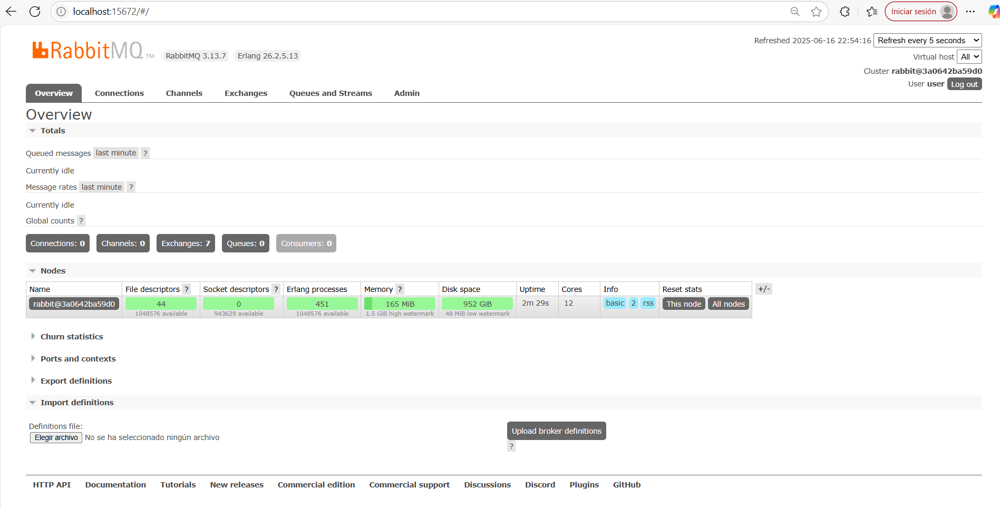
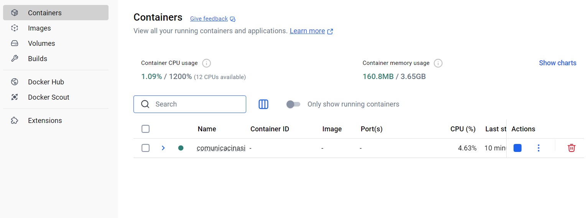
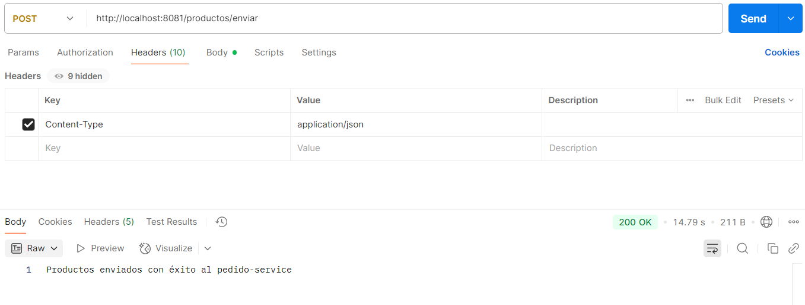

# Comunicación asincrónica - RabbitMQ

RabbitMQ es un sistema de mensajería basado en colas (message broker), que permite la comunicación entre aplicaciones de manera asincrónica. Los productores envían mensajes a colas, y los consumidores los procesan cuando estén listos.

Beneficios:

- Desacoplamiento entre servicios.
- Mayor tolerancia a fallos.
- Escalabilidad.
- Control sobre la velocidad de procesamiento.

Usos comunes: sistemas de microservicios, procesamiento de eventos, cargas de trabajo en background.

