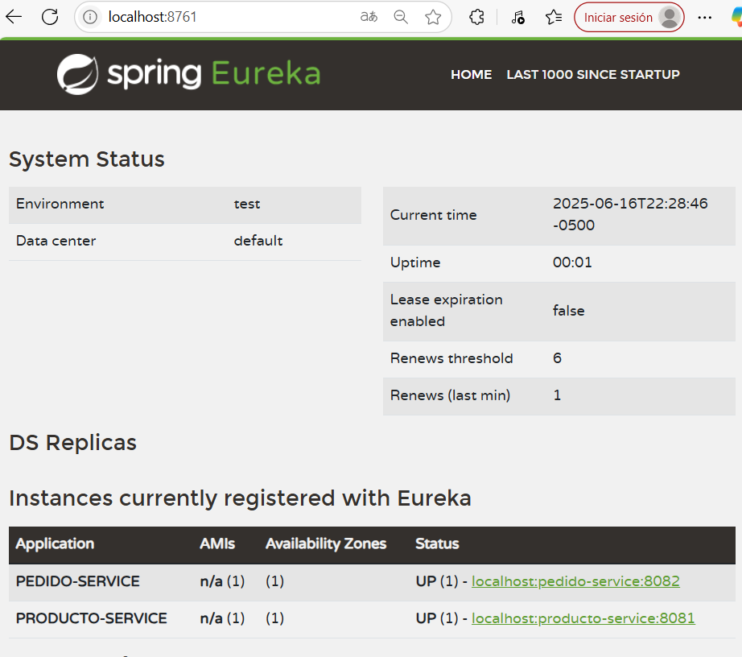
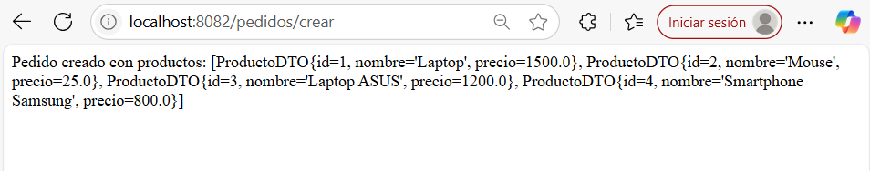

# Comunicación sincrónica - OpenFeign

OpenFeign es una librería declarativa de clientes HTTP, integrada en el ecosistema de Spring Cloud. Permite a los desarrolladores definir interfaces Java que representan llamadas a otros servicios HTTP, sin necesidad de manejar manualmente el código de peticiones.

Características:

- Facilita la comunicación REST entre microservicios.
- Integración sencilla con Spring Boot.
- Manejo automático de serialización/deserialización JSON.
- Integración con herramientas de tolerancia a fallos (como Resilience4j).

-----------------

- Del codelab inicial acomodar el GetMapping, ya que en la ruta el pedido lo estaba entendiendo como /productos/productos porque la ruta y el GetMapping tenian el /productos