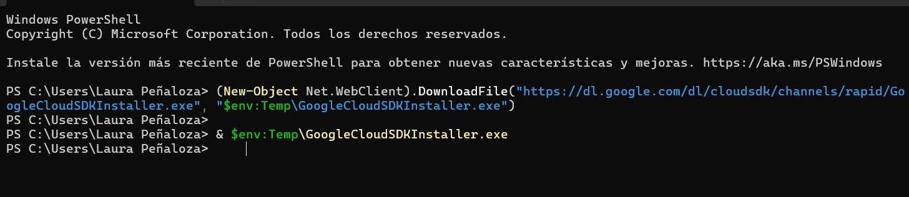

# Kubernetes con GCP

Al intentar realizar el codelab se presentaron algunos inconvenientes

- **Instalación**: Luego de realizar la instalación 3 veces, el sistema seguuia sin reconocer el GCLOUD.
- **Services**: No me dejo verificar la forma de pago, ya que al descontar los 3000 siempre decia que no era posible, y al intentar haccerlo por la carga del documento tampoco aceptaba la verificación.

