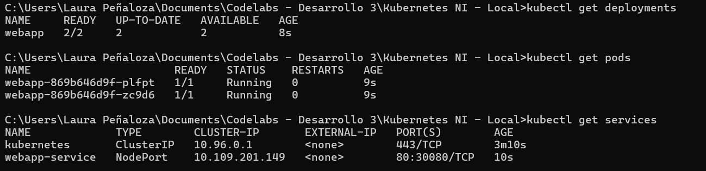
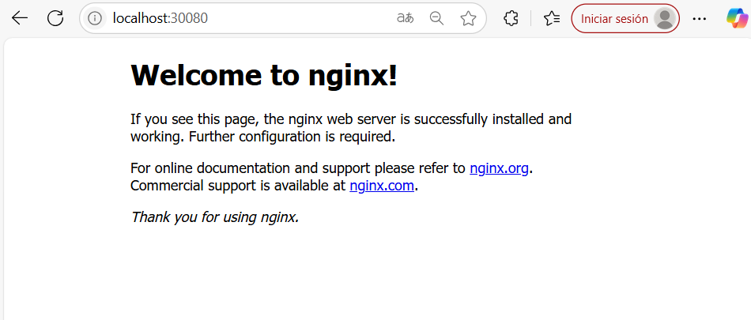

# Kubernetes

Kubernetes es una plataforma de orquestación de contenedores open-source que automatiza la implementación, escalado y gestión de aplicaciones en contenedores.

Componentes clave:

- **Pods**: unidades básicas de ejecución.
- **Services**: exponen aplicaciones hacia el exterior.
- **Deployments**: definen el estado deseado de las aplicaciones.
- **ConfigMaps/Secrets**: gestión de configuraciones.

Ventajas:

- Alta disponibilidad.
- Escalabilidad automática.
- Rolling updates y rollbacks.
- Abstracción de la infraestructura subyacente.

-------

