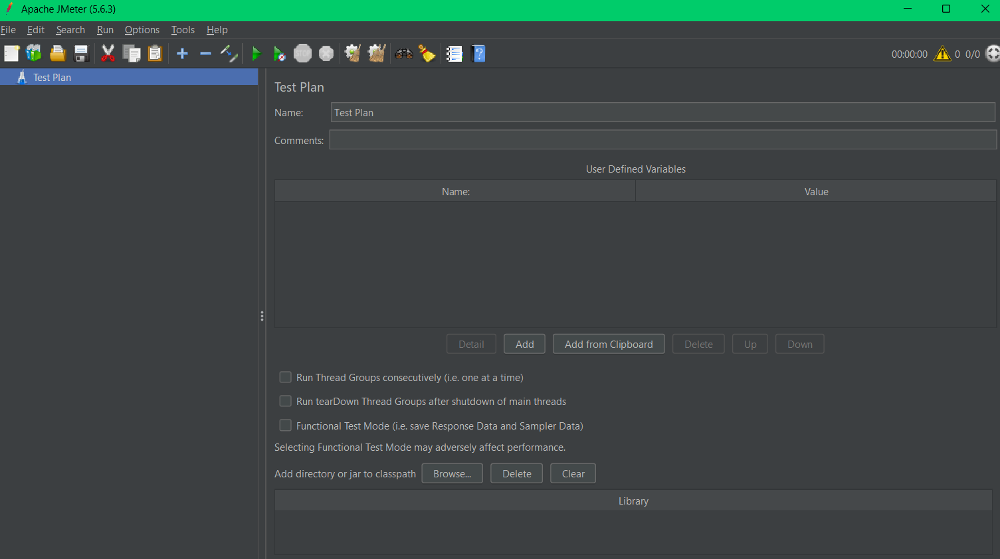
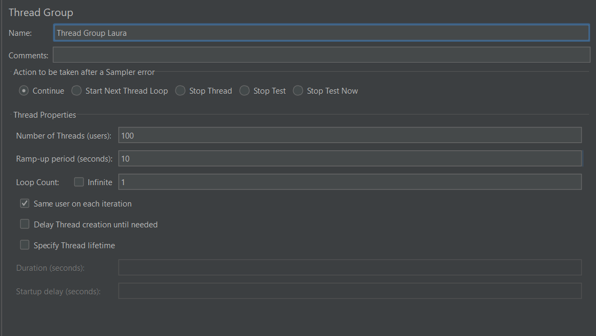
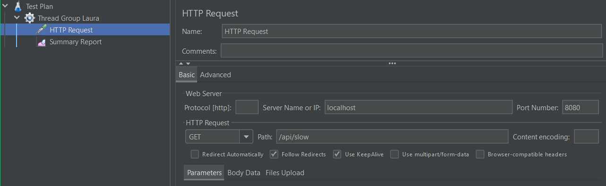
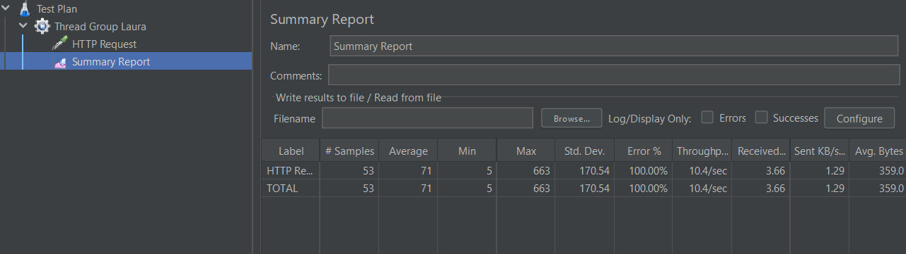
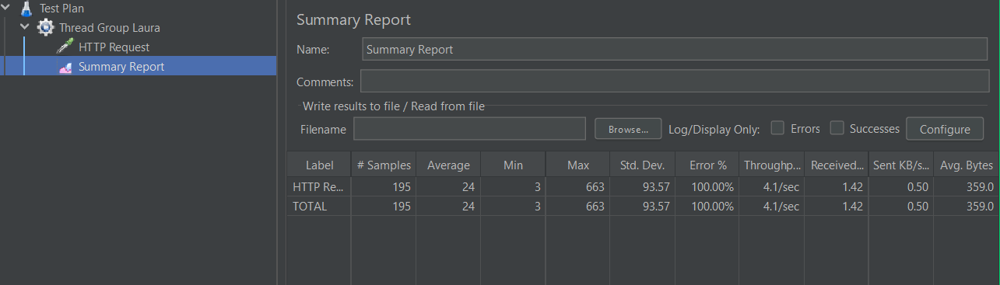
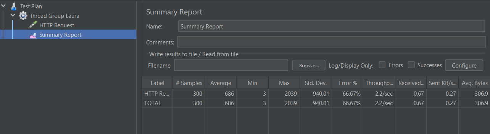
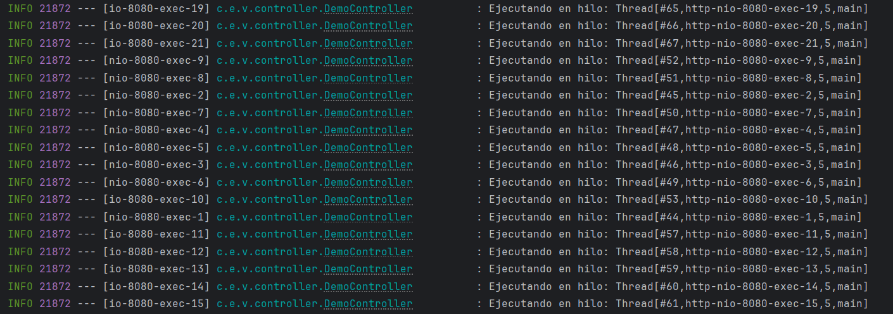

# Virtual Threads

Virtual Threads son una nueva característica introducida en Java (Project Loom), que permite crear miles de hilos ligeros gestionados por la JVM, en lugar de depender del sistema operativo.

Ventajas:

- Soportan alta concurrencia con menos uso de recursos.
- Simplifican la programación concurrente.
- Permiten modelos de programación más simples (no se requieren frameworks reactivas en muchos casos).

Son ideales para aplicaciones que manejan muchas solicitudes simultáneas (por ejemplo, APIs REST).

